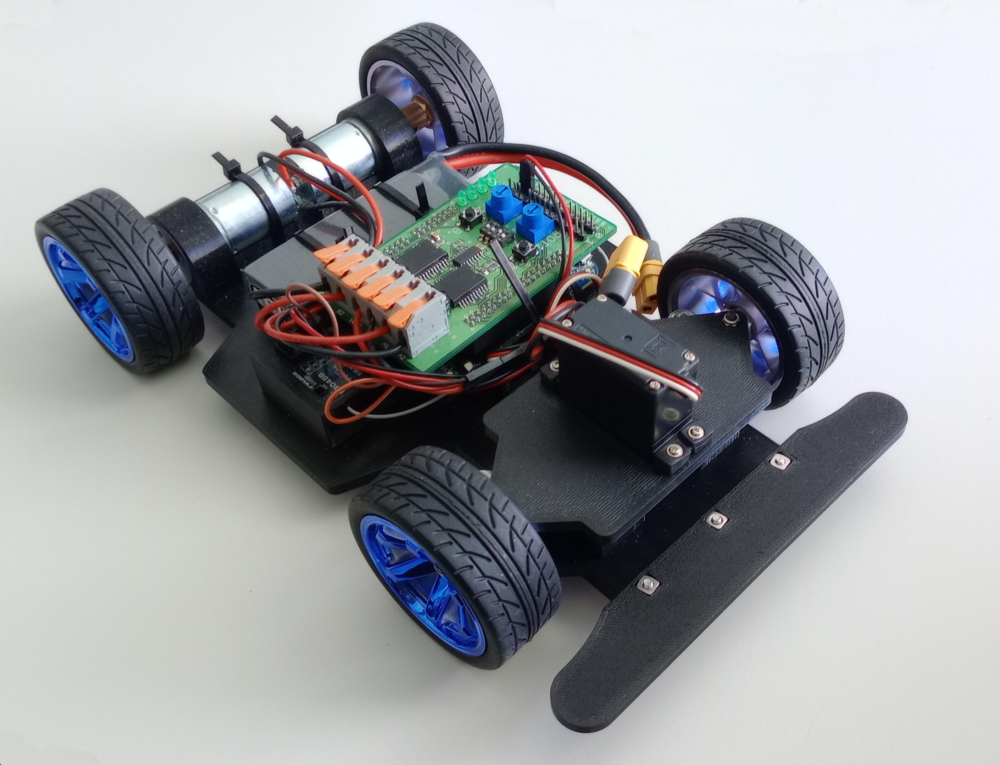

# Model auta pro NXP Cup
Tento repozitář obsahuje CAD modely vytvořené pro mou bakalářskou práci „Sestavení modelu auta pro NXP Cup a jeho programové řízení“.

Odkazy:
 - [návod na sestavení](https://github.com/j-jzk/bp-prace/blob/master/navod.md)
 - [text práce](https://github.com/j-jzk/bp-prace/blob/master/2026_JEZ0098_BP.pdf)
 - [kód pro mikrokontrolér](https://github.com/j-jzk/bp-program)

